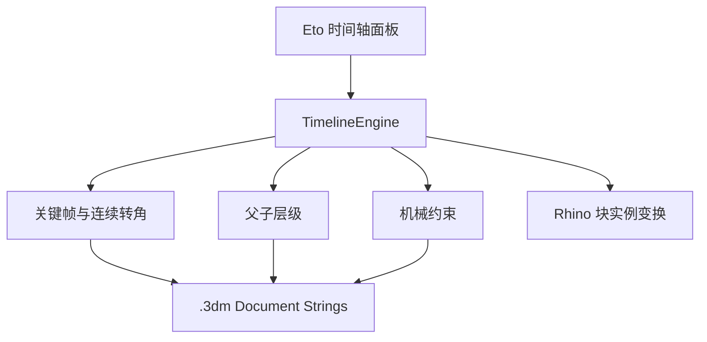

# ProductMotion Timeline 技术设计 v0.2

## 1. 目标

为 Rhino 产品建模流程提供轻量关键帧动画和装配运动学：既能像 Blender 一样给零件卡帧，也能表达父子装配、组内局部运动和齿轮传动，用于拨盘、齿轮组、柜门、连杆、角色、旋转楼梯等产品动态演示。

## 2. 双版本架构

| Rhino | 目标框架 | SDK 引用 | 发布目录 |
| --- | --- | --- | --- |
| Rhino 7 | `net48` | RhinoCommon 7 | `dist/net48` |
| Rhino 8 | `net8.0` | RhinoCommon 8 | `dist/net8.0` |

UI 使用 Eto.Forms；程序集保持 AnyCPU。Rhino 8 使用官方当前建议的 .NET 8 目标，Rhino 7 继续使用 .NET Framework 4.8。

## 3. 数据与执行关系

数据版本为 3。读取器兼容原 v0.1 使用的版本 2 数据；旧文件第一次保存后升级，但不会丢失既有轨道和关键帧。

## 4. 轨道与关键帧

每条轨道保存：

- 轨道 GUID、块实例 GUID、名称、启用状态。
- `BaseTransform`：建立轨道时的世界变换。
- `PivotTransform`：轴心与局部 XYZ 方向。
- `ParentTrackId` 与 `ParentBindTransform`：逻辑父级和绑定姿态。
- 若干关键帧：帧号、位移、四元数旋转、三轴缩放、连续轴转角、插值方式。

单轨道自身目标变换：

`Own = Pivot × T × Raxis × Rcaptured × S × Pivot⁻¹ × Base`

其中 `Raxis` 使用单独的连续角度通道，可表达 0→360°、0→720° 和反向多圈转动。

## 5. 父子层级

父子关系不依赖 Rhino 嵌套块，而是在时间轴中建立逻辑装配树。这样父件、子件仍是独立块，子件可单独选择和卡帧。

绑定时记录父件当前世界姿态 `ParentBind`。播放时：

`ChildWorld = ParentWorld × ParentBind⁻¹ × ChildOwn`

由此得到：

- 父级位移、旋转、缩放全部传递给子级。
- 子级的自身关键帧继续叠加。
- 多级层级递归求值。
- 设置父级和机械约束时检查循环，避免无限递归。

时间轴按树形顺序显示轨道，子级缩进；机械从动轨道显示 `[传]` 标识。

## 6. Rhino 组内局部动画

Rhino `Group` 只是选择组织，不提供稳定的独立变换。`PMTAddGroupPart` 使用 `GetObject.GroupSelect = false`，因此点击组内对象时不会自动扩大到整组。所选零件被转换成独立 Block Instance，未选择的组成员保持不变；多个被选零件若具有共同组关系，新动画块继承该共同组关系。

这解决了“整套模型已经打组，但只让齿轮、门板或角色手臂运动”的工作流。

## 7. 机械传动约束

每个从动轨道最多有一条主动约束；一个主动轨道可以驱动多个从动轨道。约束保存：

- 主动轨道、从动轨道。
- 类型：外啮合齿轮、内啮合齿轮、皮带。
- 主动齿数、从动齿数。
- 相位偏移。
- 启用状态。

外啮合：

`DrivenAngle = Phase - DriverAngle × DriverTeeth / DrivenTeeth`

内啮合和皮带：

`DrivenAngle = Phase + DriverAngle × DriverTeeth / DrivenTeeth`

绑定时根据主动件和从动件当前角度计算默认相位，因此确认默认值不会改变现有啮合姿态。机械约束只替换从动轨道的连续轴角度；其平移、缩放和剩余四元数旋转仍来自自身关键帧。

驱动求值使用递归缓存，可串联多级齿轮。建立约束前沿上游链检查循环，拒绝 A→B→A 等无效关系。

## 8. 变换求值顺序

每帧按以下顺序计算：

1. 插值轨道自身关键帧。
2. 若为机械从动件，根据主动件连续轴角度覆盖从动连续角。
3. 计算轨道 `Own` 目标变换。
4. 若有父级，叠加父级相对绑定姿态的世界增量。
5. 把绝对目标变换应用到 Rhino 块实例。

这允许同一零件同时是：某装配的子级、某齿轮的从动件，以及下一齿轮的主动件。

## 9. 文档持久化

动画数据以版本化二进制格式转 Base64，存入 `ProductMotionTimeline.Data.v1`。对象属性继续写入轨道 GUID，用于对象 ID 因变换更新后自动找回；用户替换对象后可用 `PMTRebind`。

## 10. 设计边界与后续方向

当前机械约束属于运动学演示：不求解碰撞、受力、齿侧间隙、模数匹配或真实接触。轴心、齿轮中心距和实体啮合由设计师在 Rhino 模型中确定。

后续可继续增加：

- 铰链、滑块、距离、路径跟随与朝向约束。
- 曲柄滑块、凸轮、棘轮、往复和延迟触发模板。
- 父级解除时的动画烘焙。
- 相机、显隐、材质、灯光轨以及帧序列/视频导出。
- 动画曲线编辑器与 Bezier 手柄。
