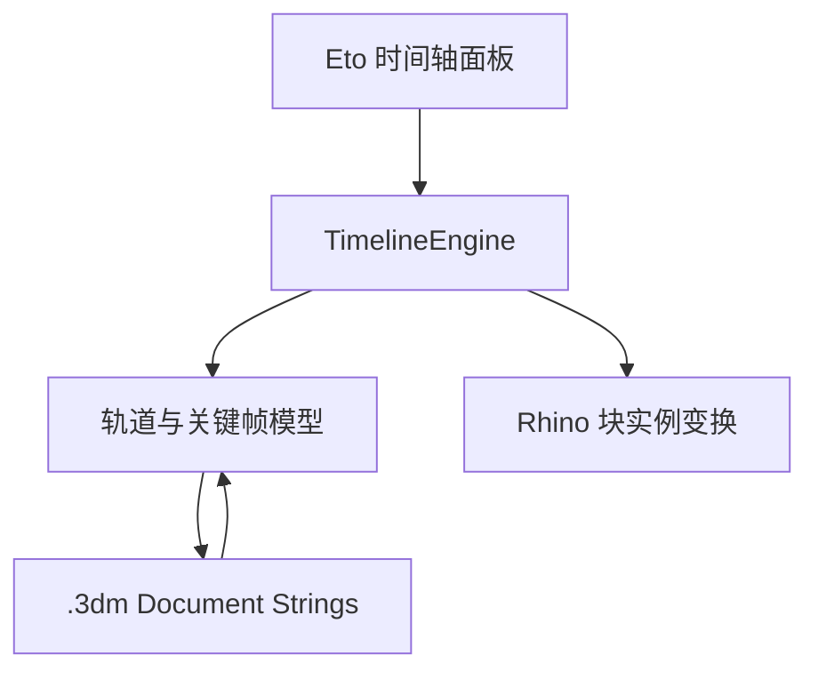

# ProductMotion Timeline 技术设计 v0.1

## 1. 目标

为 Rhino 产品建模流程补上轻量动画能力：设计师不用切换到 Blender，也能在 Rhino 中给机构部件卡关键帧、拖动时间轴、检查动作节奏，用于拨盘回弹、齿轮联动、门窗开合、角色摆动、楼梯转动等产品动态演示。

## 2. 双版本架构

同一个 SDK 风格 C# 工程多目标编译：

| Rhino | 目标框架 | SDK 引用 | 发布目录 |
| --- | --- | --- | --- |
| Rhino 7 | `net48` | RhinoCommon 7 | `dist/net48` |
| Rhino 8 | `net7.0` | RhinoCommon 8 | `dist/net7.0` |

两个 `.rhp` 来自同一套源码和同一插件 GUID。UI 使用 Eto.Forms，不依赖 WPF，因此核心代码也为后续 Mac 适配留出空间。

## 3. 数据与执行关系

每个动画轨道保存：

- 轨道 GUID 与当前块实例 GUID。
- 初始世界变换 `BaseTransform`。
- 轴心坐标系 `PivotTransform`。
- 若干关键帧：帧号、位移、四元数旋转、三轴缩放、连续轴转角、插值方式。

目标世界变换按以下顺序计算：

`Target = Pivot × T × Raxis × Rcaptured × S × Pivot⁻¹ × Base`

这样旋转与缩放会围绕自定义轴心，而不是绕世界原点。插入关键帧时反向求出 `Pose`，所以用户仍然使用熟悉的 Rhino Gumball 摆姿态。

## 4. 插值

- 位移：逐轴线性插值。
- 旋转：四元数最短路径球面插值（Slerp）。
- 缩放：逐轴线性插值。
- 平滑：在上述插值前对时间参数使用 SmoothStep。
- 阶梯：保持前一关键帧，直到下一关键帧。

四元数方案比直接插值欧拉角更适合连续齿轮和拨盘动作，可减少跨越 ±180° 时的突然反转。

四元数本身无法区分 0° 与 360° 的相同终态，所以每条轨道另有一个连续轴转角通道。关键帧直接保存数值角度，0→360、0→720 或 0→-360 都会按指定方向完整转动。

## 5. 动画部件策略

Rhino 普通几何体没有像 Blender Object 那样可长期读取的独立对象变换。因此 v0.1 把动画部件统一为 Block Instance：

1. 如果只选择一个现有块实例，直接绑定。
2. 如果选择普通几何或多个对象，复制几何与属性创建块定义。
3. 在世界原点插入块实例，再删除原对象。
4. 轨道只动画块实例的完整变换。

这一策略同时适合木质拼装产品：可把一套刚性连接的板件作为一个动画部件，把需要相对运动的板件拆成不同轨道。

## 6. 文档持久化

关键帧以版本化二进制格式转 Base64，存到 Rhino 文档字符串表的 `ProductMotionTimeline.Data.v1`。块属性中另写轨道 GUID，用于对象 ID 因变换而改变后自动找回；如果用户替换了对象，可用 `PMTRebind` 修复。

## 7. 后续迭代建议

### v0.2：演示交付

- 相机轨：相机位置、目标点、镜头焦距、平行/透视切换。
- 显隐轨：爆炸图与分步装配。
- 帧序列导出：按设定分辨率输出 PNG，再调用 FFmpeg 生成 MP4/GIF。
- 关键帧范围框选、批量移动、缩放时间、循环区间。

### v0.3：机械动画

- 驱动器/从动器：按齿数自动生成齿轮转速比与反向关系。
- 往复、凸轮、曲柄滑块、摆杆、延迟触发等参数化动作模板。
- 约束轨：轴向移动、单轴旋转、路径跟随、朝向目标。
- 动作片段库：开门、弹起、回弹、轻摆、连续旋转、停顿后触发。

### v0.4：产品演示编辑

- 事件轨：声音、灯光、文字提示、命令触发。
- 材质与发光强度关键帧。
- 动画片段复制到其他 Rhino 文件。
- 动画曲线编辑器与 Bezier 手柄。
